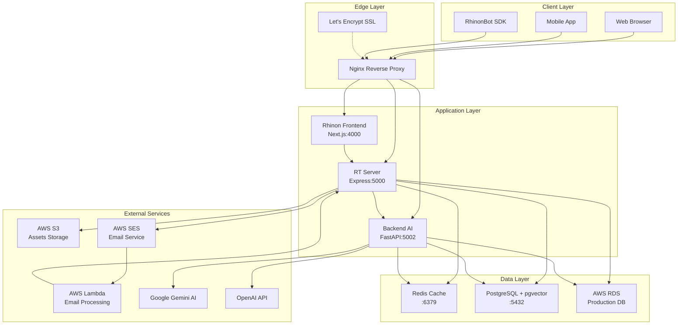
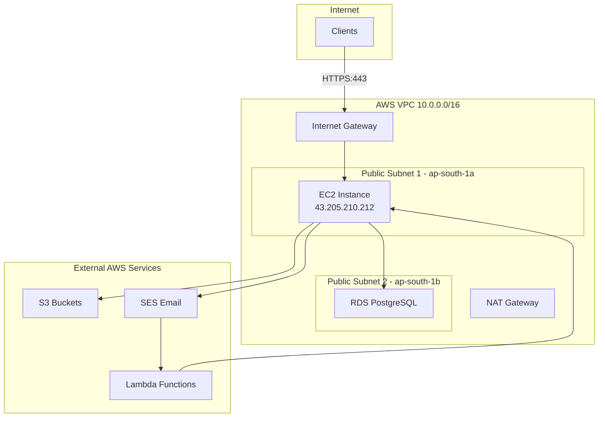
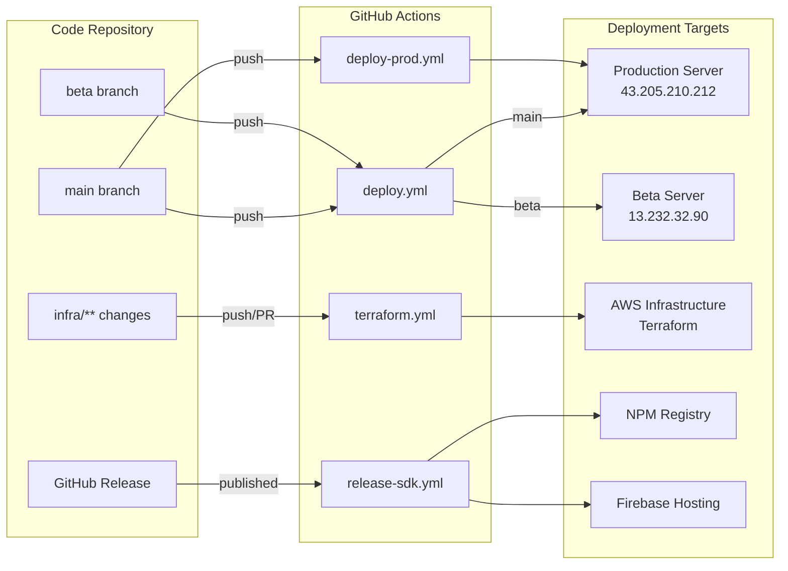

# Rhinon Tech Platform - Complete Project Overview

> **Last Updated:** January 14, 2026  
> **Version:** 2.0.0  
> **Status:** ✅ Production Ready

---

## 📋 Table of Contents

- [Executive Summary](#executive-summary)
- [Project Architecture](#project-architecture)
- [Deployed Environments](#deployed-environments)
- [Project Structure](#project-structure)
- [Infrastructure Details](#infrastructure-details)
- [SSL/TLS Configuration](#ssltls-configuration)
- [Networking & Security](#networking--security)
- [Database Architecture](#database-architecture)
- [CI/CD Pipeline](#cicd-pipeline)
- [Monitoring & Logging](#monitoring--logging)

---

## 🎯 Executive Summary

**Rhinon Tech Platform** is a comprehensive AI-powered business automation platform consisting of:
- **Frontend Application** (Next.js) - Modern web interface
- **Backend API Server** (Express.js/Node.js) - RESTful API and business logic
- **AI Service** (FastAPI/Python) - AI/ML capabilities with Gemini integration
- **SDK** (TypeScript) - Client library for third-party integrations
- **Infrastructure** (Terraform/AWS) - Automated cloud infrastructure

### Technology Stack

| Component | Technology | Language | Port |
|-----------|-----------|----------|------|
| Frontend | Next.js 15 | TypeScript | 4000 |
| Backend API | Express.js | JavaScript | 3000/5000 |
| AI Service | FastAPI | Python 3.11 | 5002 |
| Database | PostgreSQL + pgvector | SQL | 5432 |
| Cache | Redis | - | 6379 |
| Reverse Proxy | Nginx | - | 80/443 |
| SDK | TypeScript Library | TypeScript | - |

---

## 🏗️ Project Architecture



---

## 🌍 Deployed Environments

### Production Environment

| Component | Domain | IP Address | SSL Certificate |
|-----------|--------|------------|-----------------|
| **Frontend** | `app.rhinon.tech` | `43.205.210.212` | `/etc/letsencrypt/live/app.rhinon.tech/` |
| **Backend API** | `api.rhinon.tech` | `43.205.210.212` | `/etc/letsencrypt/live/app.rhinon.tech/` |
| **AI Service** | `api-ai.rhinon.tech` | `43.205.210.212` | `/etc/letsencrypt/live/app.rhinon.tech/` |

**Server Details:**
- **Instance Type:** AWS EC2 (Ubuntu 22.04 LTS)
- **Instance Name:** `rhinon-platform-prod`
- **Region:** `ap-south-1` (Mumbai)
- **Public IP:** `43.205.210.212`
- **Key Pair:** `rhinon-prod-key.pem`
- **Root Volume:** 30 GB SSD

**SSL Configuration:**
- **Certificate Authority:** Let's Encrypt
- **Certificate Path:** `/etc/letsencrypt/live/app.rhinon.tech/fullchain.pem`
- **Private Key Path:** `/etc/letsencrypt/live/app.rhinon.tech/privkey.pem`
- **Auto-Renewal:** Enabled via Certbot
- **Protocols:** TLS 1.2, TLS 1.3
- **Cipher Suites:** Modern, secure ciphers only

**DNS Records (CNAME):**
```
app.rhinon.tech        → 43.205.210.212
api.rhinon.tech        → 43.205.210.212
api-ai.rhinon.tech     → 43.205.210.212
rhinon.tech            → 43.205.210.212
```

---

### Beta/Staging Environment

| Component | Domain | IP Address | SSL Certificate |
|-----------|--------|------------|-----------------|
| **Frontend** | `beta.rhinon.tech` | `13.232.32.90` | `/etc/letsencrypt/live/beta.rhinon.tech/` |
| **Backend API** | `beta-api.rhinon.tech` | `13.232.32.90` | `/etc/letsencrypt/live/beta.rhinon.tech/` |
| **AI Service** | `beta-api-ai.rhinon.tech` | `13.232.32.90` | `/etc/letsencrypt/live/beta.rhinon.tech/` |

**Server Details:**
- **Instance Type:** AWS EC2 (Ubuntu 22.04 LTS)
- **Instance Name:** `rhinon-platform-beta`
- **Region:** `ap-south-1` (Mumbai)
- **Public IP:** `13.232.32.90`
- **Key Pair:** `rhinon-beta-key.pem`
- **Root Volume:** 30 GB SSD

**SSL Configuration:**
- **Certificate Authority:** Let's Encrypt
- **Certificate Path:** `/etc/letsencrypt/live/beta.rhinon.tech/fullchain.pem`
- **Private Key Path:** `/etc/letsencrypt/live/beta.rhinon.tech/privkey.pem`
- **Auto-Renewal:** Enabled via Certbot

**DNS Records (CNAME):**
```
beta.rhinon.tech           → 13.232.32.90
beta-api.rhinon.tech       → 13.232.32.90
beta-api-ai.rhinon.tech    → 13.232.32.90
```

---

### Development Environment

**Local Development:**
- **Frontend:** `http://localhost:4000`
- **Backend API:** `http://localhost:3000`
- **AI Service:** `http://localhost:5002`
- **PostgreSQL:** `localhost:5432`
- **Redis:** `localhost:6380`

**Docker Network:** `rhinon-network` (bridge mode)

---

## 📁 Project Structure

```
rhinontech_platform/
├── 📂 rhinon/                      # Frontend Application (Next.js)
│   ├── src/
│   │   ├── app/                    # Next.js App Router pages
│   │   ├── components/             # React components
│   │   ├── lib/                    # Utilities and helpers
│   │   └── styles/                 # CSS and styling
│   ├── public/                     # Static assets
│   ├── Dockerfile                  # Frontend container config
│   ├── package.json                # Node.js dependencies
│   └── next.config.ts              # Next.js configuration
│
├── 📂 rtserver/                    # Backend API Server (Express.js)
│   ├── controllers/                # API route handlers (31 files)
│   ├── models/                     # Sequelize ORM models (48 files)
│   ├── routes/                     # Express routes (29 files)
│   ├── migrations/                 # Database migrations (54 files)
│   ├── services/                   # Business logic services
│   ├── middleware/                 # Express middleware
│   ├── utils/                      # Helper utilities (8 files)
│   ├── config/                     # Configuration files
│   ├── app.js                      # Express app entry point
│   ├── Dockerfile                  # Backend container config
│   └── package.json                # Node.js dependencies
│
├── 📂 backendai/                   # AI Service (FastAPI)
│   ├── controller/                 # API controllers (9 files)
│   ├── routes/                     # FastAPI routes (9 files)
│   ├── services/                   # AI service logic (6 files)
│   ├── resources/                  # AI resources (6 files)
│   ├── utils/                      # Utility functions
│   ├── DB/                         # Database connections
│   ├── data/                       # Training data
│   ├── main.py                     # FastAPI app entry point
│   ├── Dockerfile                  # AI service container config
│   └── requirements.txt            # Python dependencies
│
├── 📂 rhinonbot-sdk/               # TypeScript SDK
│   ├── src/                        # SDK source code
│   ├── dist/                       # Compiled SDK
│   ├── tools/                      # Build tools (6 files)
│   ├── package.json                # NPM package config
│   ├── firebase.json               # Firebase hosting config
│   └── README.md                   # SDK documentation
│
├── 📂 infra/                       # Infrastructure as Code (Terraform)
│   ├── modules/                    # Reusable Terraform modules
│   │   ├── vpc/                    # VPC configuration
│   │   ├── ec2/                    # EC2 instance module
│   │   ├── rds/                    # RDS database module
│   │   ├── s3/                     # S3 bucket module
│   │   ├── ses/                    # SES email module
│   │   ├── lambda-email/           # Lambda function module
│   │   └── security-groups/        # Security group module
│   ├── envs/
│   │   ├── prod/                   # Production environment
│   │   │   ├── main.tf             # Main infrastructure config
│   │   │   ├── variables.tf       # Variable definitions
│   │   │   ├── outputs.tf         # Output values
│   │   │   ├── backend.tf         # Terraform state backend
│   │   │   └── providers.tf       # AWS provider config
│   │   └── beta/                   # Beta/staging environment
│   │       ├── main.tf
│   │       ├── variables.tf
│   │       ├── outputs.tf
│   │       ├── backend.tf
│   │       └── providers.tf
│   ├── bootstrap/                  # Initial setup scripts
│   ├── backend.tf                  # Root backend config
│   └── providers.tf                # Root provider config
│
├── 📂 nginx/                       # Nginx Reverse Proxy Configs
│   ├── prod.conf                   # Production nginx config
│   └── beta.conf                   # Beta nginx config
│
├── 📂 scripts/                     # Utility Scripts
│   ├── init-db.sql                 # Database initialization
│   └── (12 files total)
│
├── 📂 docs/                        # Documentation
│   └── (10 files)
│
├── 📂 .github/                     # GitHub Actions CI/CD
│   └── workflows/
│       ├── deploy-production.yml   # Production deployment
│       ├── deploy-beta.yml         # Beta deployment
│       └── sdk-release.yml         # SDK release automation
│
├── 📄 docker-compose.yml           # Development environment
├── 📄 docker-compose.prod.yml      # Production environment
├── 📄 .env.dev                     # Development environment vars
├── 📄 .env.beta                    # Beta environment vars
├── 📄 .env.production              # Production environment vars
├── 📄 Makefile                     # Build automation commands
├── 📄 README.md                    # Project documentation
└── 📄 rhinon-prod-key.pem          # Production SSH key
```

### Component Breakdown

| Directory | Purpose | Files | Lines of Code (Est.) |
|-----------|---------|-------|---------------------|
| `rhinon/` | Frontend web application | 474+ | ~25,000 |
| `rtserver/` | Backend API server | 187+ | ~15,000 |
| `backendai/` | AI/ML services | 42+ | ~8,000 |
| `rhinonbot-sdk/` | Client SDK library | 149+ | ~5,000 |
| `infra/` | Infrastructure code | 38+ | ~2,500 |
| **Total** | **Complete platform** | **890+** | **~55,500** |

---

## 🏗️ Infrastructure Details

### AWS Resources (Per Environment)

#### Compute
- **EC2 Instance:** `t3.medium` (2 vCPU, 4 GB RAM)
- **AMI:** Ubuntu 22.04 LTS (Jammy)
- **Root Volume:** 30 GB GP3 SSD
- **Auto-scaling:** Not configured (single instance)

#### Networking
- **VPC:** Custom VPC with CIDR block
  - **Production:** `10.0.0.0/16`
  - **Beta:** `10.1.0.0/16`
- **Subnets:** 2 public subnets across availability zones
  - **Subnet 1:** `10.x.1.0/24` (ap-south-1a)
  - **Subnet 2:** `10.x.2.0/24` (ap-south-1b)
- **Internet Gateway:** Attached to VPC
- **Route Tables:** Public route table with IGW route

#### Database
- **RDS Instance:** PostgreSQL 15 with pgvector extension
- **Instance Class:** `db.t3.micro` (1 vCPU, 1 GB RAM)
- **Storage:** 20 GB GP3 SSD with auto-scaling
- **Multi-AZ:** Disabled (single instance)
- **Backup:** Automated daily backups (7-day retention)
- **Encryption:** At-rest encryption enabled

#### Storage
- **S3 Buckets:**
  - `rhinon-prod-assets-rhinon` - Production assets
  - `rhinon-beta-assets-rhinon` - Beta assets
  - `rhinon-prod-emails-rhinon` - Production email storage
  - `rhinon-beta-emails-rhinon` - Beta email storage
- **Versioning:** Enabled
- **Encryption:** AES-256 server-side encryption
- **Lifecycle Policies:** Configured for cost optimization

#### Email & Messaging
- **SES (Simple Email Service):**
  - Domain verification for `rhinon.tech`
  - DKIM signing enabled
  - SPF records configured
  - Email receiving rules configured
- **Lambda Functions:**
  - Email processing function
  - Triggered by SES receipt rules
  - Forwards to RT Server API

#### Security Groups

**EC2 Security Group:**
```
Inbound Rules:
- Port 22 (SSH)         → Restricted IP addresses
- Port 80 (HTTP)        → 0.0.0.0/0 (redirect to HTTPS)
- Port 443 (HTTPS)      → 0.0.0.0/0
- Port 3000 (API)       → VPC only
- Port 4000 (Frontend)  → VPC only
- Port 5002 (AI)        → VPC only

Outbound Rules:
- All traffic           → 0.0.0.0/0
```

**RDS Security Group:**
```
Inbound Rules:
- Port 5432 (PostgreSQL) → EC2 Security Group only

Outbound Rules:
- All traffic            → 0.0.0.0/0
```

---

## 🔐 SSL/TLS Configuration

### Certificate Details

#### Production Certificates
```
Domain: app.rhinon.tech
Certificate: /etc/letsencrypt/live/app.rhinon.tech/fullchain.pem
Private Key: /etc/letsencrypt/live/app.rhinon.tech/privkey.pem
Issuer: Let's Encrypt (R3)
Valid From: Auto-renewed
Valid Until: 90 days from issue
SANs (Subject Alternative Names):
  - app.rhinon.tech
  - api.rhinon.tech
  - api-ai.rhinon.tech
```

#### Beta Certificates
```
Domain: beta.rhinon.tech
Certificate: /etc/letsencrypt/live/beta.rhinon.tech/fullchain.pem
Private Key: /etc/letsencrypt/live/beta.rhinon.tech/privkey.pem
Issuer: Let's Encrypt (R3)
Valid From: Auto-renewed
Valid Until: 90 days from issue
SANs (Subject Alternative Names):
  - beta.rhinon.tech
  - beta-api.rhinon.tech
  - beta-api-ai.rhinon.tech
```

### SSL/TLS Best Practices Implemented

✅ **TLS 1.2 and 1.3 Only** - Older protocols disabled  
✅ **Strong Cipher Suites** - Modern, secure ciphers only  
✅ **HSTS Enabled** - HTTP Strict Transport Security  
✅ **Perfect Forward Secrecy** - DHE/ECDHE key exchange  
✅ **Auto-Renewal** - Certbot cron job configured  
✅ **HTTP to HTTPS Redirect** - All traffic encrypted  
✅ **OCSP Stapling** - Improved certificate validation  

### Certificate Renewal

**Automatic Renewal:**
```bash
# Certbot auto-renewal (runs twice daily)
0 */12 * * * certbot renew --quiet --post-hook "docker-compose restart nginx"
```

**Manual Renewal (if needed):**
```bash
# Production
sudo certbot renew --cert-name app.rhinon.tech

# Beta
sudo certbot renew --cert-name beta.rhinon.tech

# Restart Nginx
docker-compose restart nginx
```

---

## 🌐 Networking & Security

### Network Architecture



### Port Mapping

#### Production Environment

| Service | Internal Port | External Port | Protocol | Access |
|---------|--------------|---------------|----------|--------|
| Nginx | 80 | 80 | HTTP | Public (redirects to 443) |
| Nginx | 443 | 443 | HTTPS | Public |
| Rhinon (Frontend) | 4000 | - | HTTP | Internal only |
| RT Server (API) | 5000 | - | HTTP | Internal only |
| Backend AI | 5002 | - | HTTP | Internal only |
| Redis | 6379 | - | TCP | Internal only |
| PostgreSQL | 5432 | - | TCP | RDS (external) |

#### Development Environment

| Service | Internal Port | External Port | Protocol | Access |
|---------|--------------|---------------|----------|--------|
| Rhinon (Frontend) | 4000 | 4000 | HTTP | localhost |
| RT Server (API) | 3000 | 3000 | HTTP | localhost |
| Backend AI | 5002 | 5002 | HTTP | localhost |
| Redis | 6379 | 6380 | TCP | localhost |
| PostgreSQL | 5432 | 5432 | TCP | localhost |

### Firewall Rules

**AWS Security Groups** act as virtual firewalls:

1. **Web Traffic:** Allow HTTPS (443) from anywhere
2. **SSH Access:** Restricted to specific IP addresses
3. **Internal Communication:** Services communicate within VPC
4. **Database Access:** RDS only accessible from EC2 instances
5. **Outbound:** All outbound traffic allowed for updates and API calls

---

## 💾 Database Architecture

### PostgreSQL Configuration

**Version:** PostgreSQL 15 with pgvector extension

**Extensions Installed:**
- `pgvector` - Vector similarity search for AI embeddings
- `uuid-ossp` - UUID generation
- `pg_trgm` - Trigram matching for fuzzy search

### Database Schema

**Primary Databases:**
- `rhinontech` - Main application database
- `rhinontech_crm` - CRM-specific data (separate schema)

**Key Tables (48 models in rtserver):**

| Category | Tables | Purpose |
|----------|--------|---------|
| **User Management** | users, roles, permissions | Authentication & authorization |
| **CRM** | leads, contacts, companies, deals | Customer relationship management |
| **Automation** | workflows, tasks, triggers | Business process automation |
| **AI/Bot** | bot_assistants, conversations, messages | AI chatbot functionality |
| **Communication** | emails, notifications, templates | Email and notification system |
| **Analytics** | events, metrics, reports | Usage tracking and analytics |

**Database Migrations:** 54 migration files tracking schema evolution

### Connection Pooling

**Development:**
```javascript
{
  max: 5,
  min: 0,
  acquire: 30000,
  idle: 10000
}
```

**Production:**
```javascript
{
  max: 20,
  min: 5,
  acquire: 30000,
  idle: 10000
}
```

### Backup Strategy

**RDS Automated Backups:**
- **Frequency:** Daily
- **Retention:** 7 days
- **Backup Window:** 03:00-04:00 UTC
- **Maintenance Window:** Sunday 04:00-05:00 UTC

**Manual Snapshots:**
- Created before major deployments
- Retained for 30 days
- Tagged with deployment version

---

## 🚀 CI/CD Pipeline

### GitHub Actions Workflows

You have **4 automated CI/CD workflows** configured:

#### 1. Application Deployment (Unified)
**File:** `.github/workflows/deploy.yml`

**Trigger:** Push to `main` or `beta` branches (excluding infrastructure changes)

**Features:**
- **Smart Environment Detection:** Automatically determines deployment target based on branch
  - `main` → Production (43.205.210.212)
  - `beta` → Beta (13.232.32.90)
- **Dynamic Configuration:** Builds environment-specific `.env` files from GitHub Secrets
- **Zero-Downtime Deployment:** Uses Docker Compose to rebuild and restart services

**Steps:**
1. Checkout code from repository
2. Determine deployment parameters (host, env file) based on branch
3. SSH to target EC2 instance
4. Clone/pull latest code from GitHub
5. Generate `.env` file with secrets (DB credentials, API keys, AWS credentials)
6. Select appropriate Nginx configuration (prod.conf or beta.conf)
7. Build and deploy with `docker-compose.prod.yml`
8. Services automatically restart with new code

**Environment Variables Injected:**
- Database credentials (RDS endpoints, passwords)
- AWS credentials (S3, SES access)
- OpenAI API keys
- JWT secrets
- Frontend/backend URLs

---

#### 2. Production Deployment (Simple)
**File:** `.github/workflows/deploy-prod.yml`

**Trigger:** Push to `main` branch only

**Purpose:** Simplified production-only deployment workflow

**Steps:**
1. SSH to production server (43.205.210.212)
2. Navigate to `/app` directory
3. Pull latest changes from `main` branch
4. Rebuild and restart containers with `docker-compose.prod.yml`

**Use Case:** Quick production deployments without environment variable updates

---

#### 3. Infrastructure Deployment (Terraform)
**File:** `.github/workflows/terraform.yml`

**Trigger:** 
- Push to `main` or `beta` branches (only when `infra/**` files change)
- Pull requests to `main` or `beta` (infrastructure changes)

**Features:**
- **Infrastructure as Code:** Automated Terraform deployments
- **Environment-Specific:** Separate state for prod and beta
- **Plan on PR:** Shows infrastructure changes in pull requests
- **Auto-Apply on Push:** Automatically applies changes when merged

**Steps:**
1. Checkout code
2. Setup Terraform CLI
3. Configure AWS credentials
4. Determine environment (prod or beta)
5. **Terraform Init:** Initialize backend and providers
6. **Terraform Plan:** Preview infrastructure changes
7. **Terraform Apply:** Apply changes (only on push to main/beta)

**Resources Managed:**
- VPC and networking (subnets, route tables, internet gateway)
- EC2 instances (application servers)
- RDS databases (PostgreSQL)
- S3 buckets (assets, email storage)
- SES email service configuration
- Lambda functions (email processing)
- Security groups and IAM roles

---

#### 4. SDK Release & Publishing
**File:** `.github/workflows/release-sdk.yml`

**Trigger:** GitHub Release published

**Purpose:** Automated SDK publishing to NPM and Firebase Hosting

**Steps:**
1. Checkout code
2. Setup Node.js 20
3. Install dependencies (`npm ci`)
4. Build SDK (`npm run build`)
5. **Publish to NPM:** Release `rhinonbot-sdk` package
6. **Deploy to Firebase Hosting:** Publish SDK documentation

**Outputs:**
- NPM package: `@rhinontech/rhinonbot-sdk` (or similar)
- Documentation site: Hosted on Firebase
- Changelog: Auto-generated from release notes

---

### CI/CD Architecture



---

### Required GitHub Secrets

Your workflows require these secrets to be configured in GitHub repository settings:

| Secret Name | Purpose | Used By |
|-------------|---------|---------|
| `SSH_PRIVATE_KEY_PROD` | SSH key for production server | deploy.yml |
| `SSH_PRIVATE_KEY_BETA` | SSH key for beta server | deploy.yml |
| `PROD_SSH_HOST` | Production server IP | deploy-prod.yml |
| `PROD_SSH_USER` | Production SSH username | deploy-prod.yml |
| `PROD_SSH_KEY` | Production SSH key | deploy-prod.yml |
| `AWS_ACCESS_KEY_ID` | AWS access key | deploy.yml, terraform.yml |
| `AWS_SECRET_ACCESS_KEY` | AWS secret key | deploy.yml, terraform.yml |
| `DB_PASSWORD_PROD` | Production database password | deploy.yml, terraform.yml |
| `DB_PASSWORD_BETA` | Beta database password | deploy.yml, terraform.yml |
| `API_KEY_PROD` | Production API key | deploy.yml, terraform.yml |
| `API_KEY_BETA` | Beta API key | deploy.yml, terraform.yml |
| `OPENAI_API_KEY` | OpenAI API key | deploy.yml |
| `NPM_TOKEN` | NPM publishing token | release-sdk.yml |
| `FIREBASE_SERVICE_ACCOUNT_RHINONTECH` | Firebase service account | release-sdk.yml |

---

### Deployment Flow

**For Application Code Changes:**
```bash
# Development → Beta
git push origin beta
# Triggers: deploy.yml → Deploys to 13.232.32.90

# Beta → Production
git push origin main
# Triggers: deploy.yml + deploy-prod.yml → Deploys to 43.205.210.212
```

**For Infrastructure Changes:**
```bash
# Make changes to infra/**
git push origin beta  # or main
# Triggers: terraform.yml → Updates AWS infrastructure
```

**For SDK Releases:**
```bash
# Create a new release on GitHub
# Triggers: release-sdk.yml → Publishes to NPM + Firebase
```

### Deployment Commands

**Using Makefile:**
```bash
# Deploy to production
make deploy-prod

# Deploy to beta
make deploy-beta

# Build all services
make build

# Run tests
make test

# View logs
make logs
```

---

## 📊 Monitoring & Logging

### Application Logging

**Log Locations:**

**Development:**
```
rhinon/rhinon.log           - Frontend logs
rtserver/log/               - Backend API logs
backendai/backend.log       - AI service logs
```

**Production:**
```
/var/log/docker/            - Docker container logs
/var/log/nginx/             - Nginx access & error logs
CloudWatch Logs             - Centralized AWS logging
```

### Log Levels

| Level | Usage | Example |
|-------|-------|---------|
| ERROR | Critical failures | Database connection failed |
| WARN | Potential issues | API rate limit approaching |
| INFO | General information | User logged in |
| DEBUG | Detailed debugging | Request payload details |

### Health Check Endpoints

**Frontend:**
```bash
curl https://app.rhinon.tech/
# Expected: 200 OK with HTML
```

**Backend API:**
```bash
curl https://api.rhinon.tech/health
# Expected: {"status": "healthy", "timestamp": "..."}
```

**AI Service:**
```bash
curl https://api-ai.rhinon.tech/hello
# Expected: {"message": "Hello from Rhinon AI"}
```

### Monitoring Tools

- **AWS CloudWatch:** Infrastructure metrics
- **Application Logs:** Centralized logging
- **Uptime Monitoring:** External service checks
- **Error Tracking:** Application error monitoring

---

## 🔧 Environment Variables

### Required Environment Variables

#### Frontend (rhinon/)
```bash
NEXT_PUBLIC_API_URL=https://api.rhinon.tech/api
NEXT_PUBLIC_API_AI_URL=https://api-ai.rhinon.tech
NEXT_PUBLIC_SOCKET_URL=https://api.rhinon.tech
```

#### Backend (rtserver/)
```bash
# Database
DB_HOST=<rds-endpoint>
DB_PORT=5432
DB_NAME=rhinontech
DB_USER=<username>
DB_PASSWORD=<password>

# AWS
AWS_ACCESS_KEY_ID=<key>
AWS_SECRET_ACCESS_KEY=<secret>
AWS_REGION=ap-south-1
S3_BUCKET=rhinon-prod-assets-rhinon

# Email
SES_EMAIL_SOURCE=noreply@rhinon.tech

# API Keys
JWT_SECRET=<secret>
API_KEY=<key>
```

#### AI Service (backendai/)
```bash
# AI APIs
GOOGLE_API_KEY=<gemini-key>
OPENAI_API_KEY=<openai-key>

# Database
DB_HOST=<rds-endpoint>
DB_NAME=rhinontech
DB_USER=<username>
DB_PASSWORD=<password>

# Redis
REDIS_HOST=redis
REDIS_PORT=6379
```

---

## 📞 Quick Reference

### SSH Access

**Production:**
```bash
ssh -i rhinon-prod-key.pem ubuntu@43.205.210.212
```

**Beta:**
```bash
ssh -i rhinon-beta-key.pem ubuntu@13.232.32.90
```

### Docker Commands

**View running containers:**
```bash
docker ps
```

**View logs:**
```bash
docker logs -f rhinon
docker logs -f rtserver
docker logs -f backendai
```

**Restart services:**
```bash
docker-compose restart
```

**Rebuild and restart:**
```bash
docker-compose up -d --build
```

### Database Access

**Production RDS:**
```bash
psql -h <rds-endpoint> -U <username> -d rhinontech
```

**Local PostgreSQL:**
```bash
psql -h localhost -U postgres -d rhinontech
```

---

## 📚 Additional Documentation

- [README.md](README.md) - Getting started guide
- [DOCKER_SETUP.md](docs/DOCKER_SETUP.md) - Docker configuration details
- [API_DOCUMENTATION.md](docs/API_DOCUMENTATION.md) - API endpoints reference
- [SDK Documentation](rhinonbot-sdk/README.md) - SDK usage guide
- [Infrastructure Guide](infra/README.md) - Terraform setup

---

## 🎯 Key Metrics

| Metric | Value |
|--------|-------|
| **Total Services** | 5 (Frontend, API, AI, Redis, PostgreSQL) |
| **Deployment Environments** | 3 (Dev, Beta, Prod) |
| **AWS Regions** | 1 (ap-south-1 Mumbai) |
| **SSL Certificates** | 2 (Prod, Beta) |
| **Database Tables** | 48+ |
| **API Endpoints** | 100+ |
| **Lines of Code** | ~55,500 |
| **Docker Images** | 3 custom images |
| **Terraform Modules** | 7 reusable modules |

---

**© 2026 Rhinon Tech. All rights reserved.**
